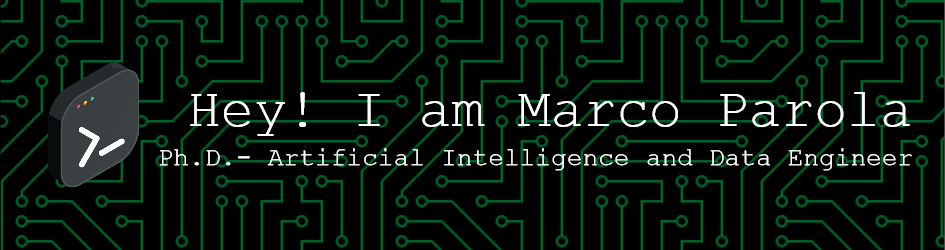

I'm a Ph.D. candidate at the Department of Information Engineering at the University of Pisa 🎓 I'm passionate about harnessing the power of AI, deep learning, and everything tech-related to create cool stuff and solve real-world problems. 🤖

## Tech Stack 🛠️

- 🔮 Python, Java, C/C++ - trusty coding companions
- 🖥️ Machine Learning and Deep Learning
- 📷 Computer Vision 🤖👀
- 🌐 Web Development - Building things that live on the internet 🌍

My strongest tricks up my sleeve

    
    
    
 

## Hobbies 🌴

When I'm not glued to my keyboard, you can find me:

- 🚴‍♂️⛰️ Cycling or trekking 
- 🤿🌊 Lost in the ocean
- 🎸🎹 Strumming a few chords on the guitar or playing piano

## Let's Connect 🌐

Feel free to reach out if you want to chat about tech or research project! Let's code together! 💻🚀

 &nbsp; &nbsp; 
 &nbsp; &nbsp;

